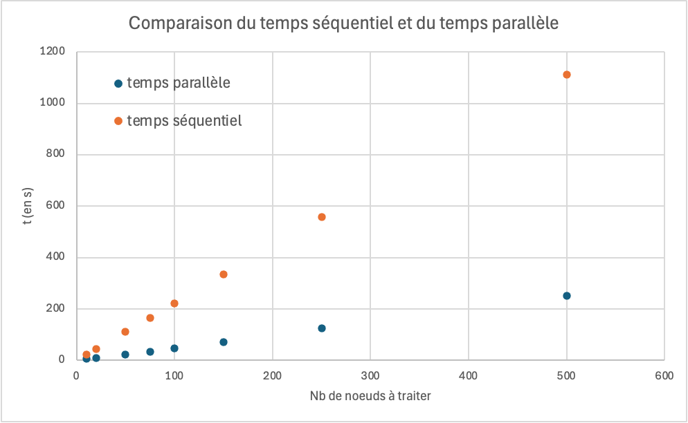

# Mini-projet APSP en Golang

Bienvenue sur ce projet en **Golang**, réalisé par Lilia Boubaker et Marceau Gaillardou.

---

## Objectif

L’objectif de ce projet est de prendre en main le langage de programmation Golang à travers l’implémentation d’un algorithme exploitant la concurrence à l’aide des goroutines, ainsi que la mise en place d’une communication TCP entre un serveur et plusieurs clients.

Pour cela, nous avons choisi d’implémenter un algorithme permettant de calculer les plus courts chemins dans un graphe connexe. Plus précisément, nous travaillons sur un graphe représentant la ville de Lyon, extrait d’OpenStreetMap.org.  
Ce graphe contient environ 8 000 nœuds, ce qui rend l’implémentation naïve de l’algorithme de Dijkstra coûteuse en temps de calcul, sa complexité étant de l’ordre de O(V²).

Afin d’améliorer les performances, nous avons opté pour une approche APSP (*All-Pairs Shortest Paths*) basée sur Dijkstra. Cette méthode consiste à lancer l’algorithme depuis chaque sommet afin de calculer les distances vers tous les autres sommets du graphe. La complexité devient alors O(V · E · log V), où V représente le nombre de nœuds et E le nombre d’arêtes.

---

## Réalisation

Après avoir récupéré le fichier JSON issu d’OpenStreetMap (`lyon.json`), nous l’avons simplifié à l’aide d’un script Python. Pour chaque nœud, nous conservons uniquement la latitude, la longitude et la liste de ses voisins. Ces données sont ensuite stockées dans un fichier nommé `sortie.json`.

Nous avons rapidement constaté que le nombre de nœuds restait trop important. Nous avons donc créé plusieurs sous-fichiers JSON en ajoutant des contraintes sur les latitudes et longitudes minimales et maximales, afin de réduire la taille des graphes. Ces fichiers permettent ensuite de simuler plusieurs clients dans le cadre de la communication TCP.

Le serveur est lancé en exécutant le script `server.go` dans un terminal. Il écoute sur un socket et attend les connexions des clients. Ces derniers se connectent en exécutant le script `client.go` dans un autre terminal, en précisant le fichier JSON à utiliser.

> **Note :** pour exécuter un programme Go, la commande est `go run server.go`. Pour le client, par exemple : `go run client.go` et ensuite renseigné le chemin absolu pour accéder au fichier json, par exemple : `'/Users/gaillardou/Desktop/ELP/GO/echantillon_client/json_reduit_1.json'`

Le serveur utilise un ensemble de workers chargés de traiter des jobs.  
Un job correspond au calcul des distances depuis un nœud donné vers tous les autres nœuds du graphe à l’aide de l’algorithme de Dijkstra.  
Chaque worker traite un job à la fois en le récupérant depuis un channel, puis renvoie le résultat au client concerné.

---

## Performances

Afin d’évaluer l’intérêt de l’utilisation de la concurrence via les goroutines, nous avons comparé les temps d’exécution entre une version séquentielle (utilisant une simple boucle `for`) et une version parallèle basée sur des workers.

Les résultats montrent que l’exécution séquentielle est presque cinq fois plus lente que l’exécution parallèle. L’utilisation de la concurrence permet donc de réduire significativement le temps total de calcul en répartissant les tâches entre plusieurs workers.

  

